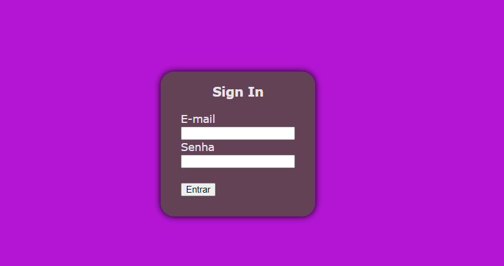

# Projeto - Login
 
Projeto criado como parte avaliativa da disciplina de Fundamentos de Desenvolvimento Web ministrada pelo professor Leonardo Rocha.
 
## Índice
* [Descrição](#descrição)
* [Tecnologias](#tecnologias)
* [Referências](#referências)
* [Autor(a)](#autora)
 
## Descrição
 
Um projeto desenvolvido para criar uma página de login.
 
 
## Tecnologias
 
* HTML5
* CSS3
* Git
* Github
 
## Códigos
 
* < padding > A propriedade padding define uma a distância entre o conteúdo de um elemento e suas bordas. É um atalho que evita definir uma distância para cada lado separadamente.

* < Height > A propriedade height do CSS determina a altura da área do conteúdo de um elemento. A área de conteúdo consiste no padding , margin e border do elemento

* < Width > A propriedade CSS width determina a largura da área de conteúdo de um elemento. A área de conteúdo fica dentro do preenchimento, da borda, e da margem de um elemento. As propriedades min-width e max-width sobrescrevem o width .

* < justify-content > controla o alinhamento de todos os itens no eixo principal.

* < align-items > controla o alinhamento de todos os itens no eixo transversal.

* border-radius - A propriedade CSS3 border-radius destina-se a definir bordas arredondadas.
 
* box-shadow - O box-shadow é uma propriedade do CSS, é utilizado para adicionar efeitos de sombra em volta de um elemento. Você pode especificar mais de um efeito, os separando com virgulas.

* font family - A propriedade font-family do CSS permite que se faça uma lista de prioridades de familias de fontes e/ou nomes genéricos de famílias a serem especificados para um elemento selecionado.

* background-color - A propriedade CSS background-color define a cor de fundo de um elemento.

## Referências
 
* [Alura](https://www.alura.com.br/artigos/escrever-bom-readme) - Como escrever um README incrivel no seu gitHub

* [MDNWebDocs](https://developer.mozilla.org/en-US/docs/Web/CSS) - Utilizado para escrever uma incrivel descrição dos elementos CSS.
 

* [Major](https://www.maujor.com) - Utilizado para descrever o elemento "border-radius".
 
## Autor(a)
 
Projeto desenvolvido pelo aluno:
 * Miguel Gonçalves Reis